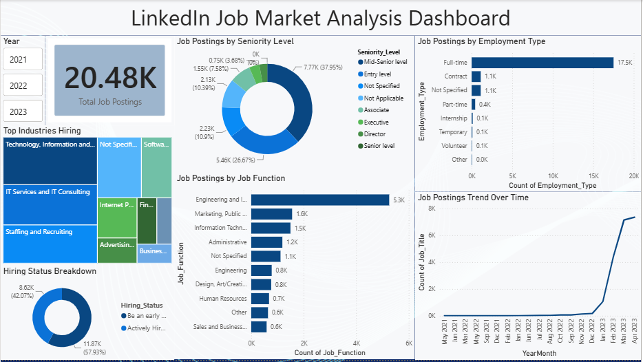

# LinkedIn Job Market Analysis Dashboard

## 📊 Overview
Power BI dashboard analyzing 20,000+ LinkedIn job postings to uncover 
hiring trends across industries, seniority levels, and employment types.

## 🎯 Key Insights
- Full-time roles dominate job postings (majority share)
- Sharp growth in postings observed Jan–April 2023
- Technology, IT Services, and Staffing industries lead in hiring
- Engineering roles are the most in-demand job function

## 🛠️ Tools Used
- Power BI Desktop
- Power Query (data cleaning & transformation)
- DAX (calculated columns, date table)

## 📸 Dashboard Preview

## 📁 Files
- `LinkedIn_Job_Market_Analysis_Dashboard.pbix` - Power BI file (open in Power BI Desktop)
- `LinkedIn_Job_Market_Analysis_Dashboard.png` - Dashboard preview image

## 🔗 Connect
[LinkedIn Profile](https://www.linkedin.com/in/muhammad-furqan-981bb4385/)
